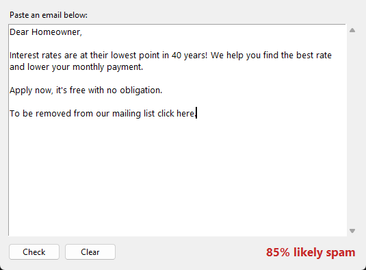
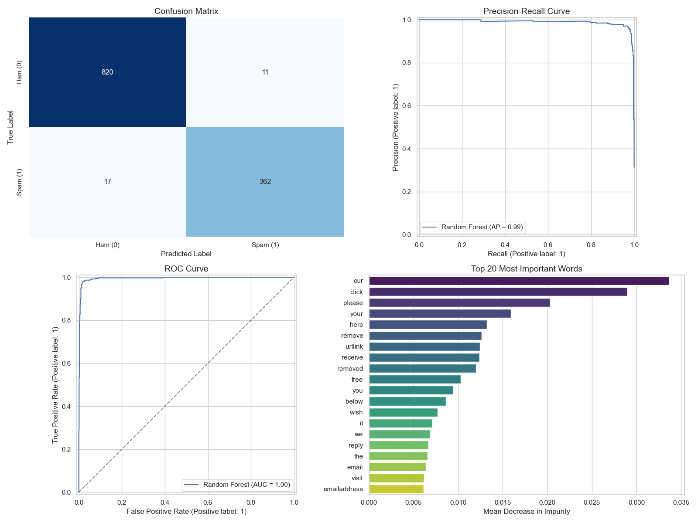

# Spam Classifier

A spam filter built with a TF-IDF vectorizer and a Random Forest from scikit-learn, trained on the
Apache SpamAssassin public corpus. It comes with a small window where you can paste an email and see
how likely it is to be spam.



## Setup

Requires Python 3.11 or newer.

```
pip install -r requirements.txt
```

## Checking an email

```
python -m spam_filter
```

Paste an email into the window and click **Check** (or press Ctrl+Enter). You can paste just the body
text or the full raw email with headers (for example from Gmail's "Show original"). The percentage is
the share of trees in the forest that voted spam.

A trained model is already included in `models/`, so this works right after installing the requirements.

## Training the model yourself

```
python -m spam_filter.download   # downloads the dataset into data/
python -m spam_filter.train      # searches for the best parameters and saves the model
python -m spam_filter.evaluate   # prints test set scores and shows the plots below
```

Training takes about a minute. To use your own emails instead, put one raw email per file in
`data/ham` and `data/spam` and run the train step.

## How it works

1. **Text extraction** - Each email is parsed and the plain text and HTML parts of the body are pulled
   out. HTML tags are stripped, quoted replies are removed, and links and email addresses are replaced
   with placeholder words.
2. **Features** - A TF-IDF vectorizer turns the text into word weights.
3. **Model** - A Random Forest classifier. `RandomizedSearchCV` tries 20 parameter combinations with
   3-fold cross validation, scored on F1.
4. **Evaluation** - 20% of the emails are held out as a test set (stratified, fixed seed).

The link/address cleanup matters more than it sounds. Most of the ham in this dataset comes from
mailing lists, and without it the model mostly learned to spot list footers and archive URLs, which
don't show up in emails people actually paste in.

## Results

On the 1,210 email test set:

|          | Precision | Recall | Support |
|----------|-----------|--------|---------|
| Ham      | 0.980     | 0.987  | 831     |
| Spam     | 0.971     | 0.955  | 379     |

Accuracy is 97.7% and ROC AUC is 0.996.



## Project structure

```
spam_filter/
    app.py          popup window
    download.py     downloads the SpamAssassin corpus
    emails.py       email parsing, text cleanup, loading the dataset
    train.py        parameter search and saving the model
    evaluate.py     test set scores and plots
models/
    spam_classifier.pkl
images/
```

## Dataset

[Apache SpamAssassin public corpus](https://spamassassin.apache.org/old/publiccorpus/), using
`easy_ham`, `easy_ham_2` and `hard_ham` (4,150 ham) and `spam` and `spam_2` (1,896 spam). Copyright for
the messages stays with their original senders, so the emails aren't included in this repo and are
downloaded instead.

## Limitations

The emails are from 2002 to 2005 and most of the ham is from tech mailing lists. Modern emails, and
short personal ones in particular, can score higher than they should. The percentage is a rough signal,
not a guarantee.
