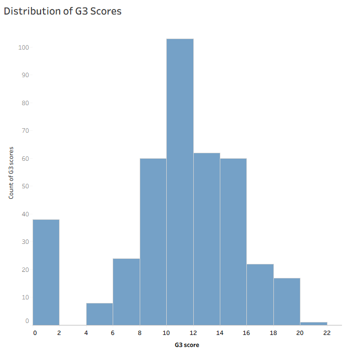
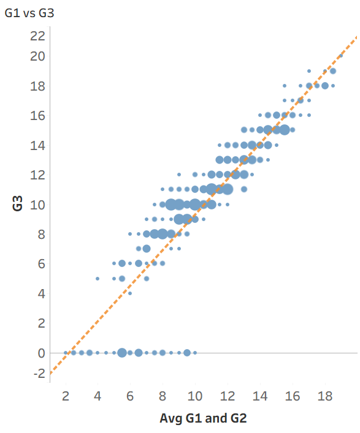
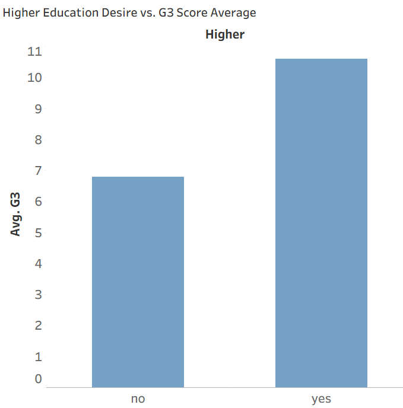
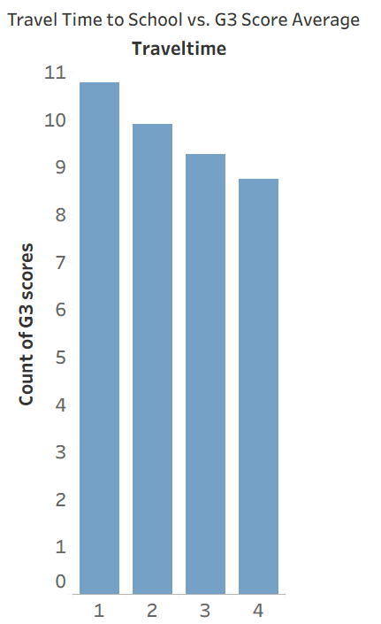

# Student Score Prediction

Predicting final-year grades for secondary school students, and testing whether that
prediction is still possible *before* first- and second-term grades are recorded.

Completed as the final project for Machine Learning Fundamentals. The analysis is in
[`notebook.ipynb`](notebook.ipynb); the written report is in
[`reports/executive-summary.pdf`](reports/executive-summary.pdf).

## Problem

The brief supplied the following scenario: the advising team for a large Portuguese school
system wants to predict student performance so it can identify students who need additional
support and direct intervention resources toward them.

That raises two questions, and the second is where the interesting work sits:

1. How accurately can a student's final grade (G3) be predicted from the available data?
2. Can it be predicted *without* the first- and second-term grades (G1 and G2)?

A model that only works once two terms of grades exist is far less useful to an advising team
than one that flags students early, so every step below is built twice — once with G1 and G2
available, once without — and the two are compared directly.

## Dataset

A 395-student extract of the [UCI Student Performance dataset](https://archive.ics.uci.edu/dataset/320/student+performance)
(Cortez and Silva, 2008), covering the Mathematics course: 35 columns spanning demographics,
family background, study habits and grades. The target, `G3`, is the final-year grade on the
Portuguese 0–20 scale.

Note that `data/student-mat.csv` is a **modified version** prepared for the course, not the file
UCI distributes. Two differences matter if you compare them:

- The original's single `absences` column is split into `absences_G1`, `absences_G2` and
  `absences_G3`.
- Missing values have been introduced, which the original does not have: `age` is 383/395
  non-null, `absences_G1` 382/395, `absences_G2` 386/395.

## Approach

**Feature selection.** Twelve of the 35 columns are carried forward: seven numeric
(`absences_G1/G2/G3`, `G1`, `G2`, `failures`, `age`), one categorical (`higher`), and four
ordinal 1–5 survey scales (`Walc`, `Dalc`, `goout`, `traveltime`). The survey scales are ordinal
encoded rather than one-hot, since their ordering carries meaning.

**Custom transformer.** `FinalProjectTransformer` sums the three absence columns into a single
`absences_sum` and drops the originals — total absences is the quantity of interest, and keeping
the terms separate spends three dimensions on it for no clear gain. It also drops `G1` and `G2`
when `drop_grades=True`, which is what makes the central comparison cheap: both model variants
come from one transformer definition, so they differ in exactly that one respect.

**Pipelines.** Median imputation and standard scaling for numeric columns, most-frequent
imputation and one-hot encoding (`drop="first"`) for categorical, most-frequent imputation and
ordinal encoding for ordinal — combined through a `ColumnTransformer`. Median rather than mean
imputation because the columns with missing values are all skewed. The result is 10 features
with G1/G2, or 8 without.

**Models.** `LinearRegression`, `LinearSVR` and `Lasso` compared by 3-fold cross-validation on
both training sets, then `LinearSVR` taken forward to a `GridSearchCV` over `C`, `max_iter` and
`tol`, and evaluated on the held-out test set.

## Results

Cross-validated RMSE on the training set (3-fold, lower is better):

| Model | With G1/G2 | Without G1/G2 |
| --- | --- | --- |
| Linear Regression | **1.88** | **4.36** |
| LinearSVR (defaults) | 2.01 | 4.37 |
| Lasso | 2.17 | 4.39 |

Held-out test set, tuned `LinearSVR`:

| | Hyperparameters | RMSE | R² |
| --- | --- | --- | --- |
| With G1/G2 | `C=1.5, tol=1e-6, max_iter=100000` | 2.09 | 0.788 |
| Without G1/G2 | `C=0.5, tol=1e-4, max_iter=10000` | 4.40 | 0.054 |

The two tables measure different things and should not be read across. The first is
cross-validation on training data and is what the model shortlist was chosen on; the second is
the generalisation estimate on data held out from the start.

With G1 and G2 available, the final grade is predicted to within roughly 2.1 points on a 0–20
scale. Without them, R² falls to 0.054 — the model reduces squared error by about 5% against
simply predicting the mean grade.

## What the data looks like

Exploration was done in Tableau; all ten charts are in [`images/`](images/).

| | |
| --- | --- |
|  |  |
| Final grades cluster around 10–12, with a spike of 38 students at zero. | The average of the first two terms tracks the final grade almost linearly. |
|  |  |
| Intent to pursue higher education is the clearest non-grade signal: 10.61 against 6.80. | Travel time is more typical of the rest — about two points across its whole range. |

## Key findings

**G1 and G2 dominate everything else.** Every model lands near RMSE 1.9–2.2 with them and near
4.4 without, regardless of algorithm. The choice of regressor matters far less than whether
prior grades are in the feature set.

**Early prediction does not work on this feature set.** An R² of 0.054 is close to no
predictive power. The non-grade features available here — family background, study time, alcohol
use, travel time, going out — move the average final grade by around two points each at most,
and that is not enough to rank students usefully before their first term is graded.

**38 students score zero despite passing first-term grades.** All 38 have a non-zero G1,
ranging from 4 to 12. They appear as a flat row along the bottom of the grade scatter plots and
are the single largest source of residual error. Nothing in the feature set anticipates them,
which suggests they reflect withdrawal or non-completion rather than academic decline — exactly
the population an advising team most wants to catch, and the one this data explains least.

**Recommendation.** The executive summary proposes using the two models at different
intervention tiers: the with-grades model to prioritise higher-cost interventions once first-
and second-term grades exist, and the without-grades model only as a low-cost early flag for
Tier 1 advisor check-ins, where a false positive costs a conversation. The R² of 0.054 is the
caveat that recommendation has to carry — at that level an early flag is only marginally better
than picking at random, and closing the gap needs data this dataset does not contain, such as
attendance trends or assignment submission during the first term.

## Limitations

Things I would do differently, and would change before treating any of this as production work:

- **The final model is selected inconsistently.** Linear Regression had the best
  cross-validation score, but `LinearSVR` is what gets tuned and evaluated on the test set, so
  the two tables above describe different algorithms. The comparison would be cleaner if every
  candidate were tuned and tested.
- **Tuned parameters are hardcoded rather than taken from the search.** The final fit
  re-specifies `LinearSVR(tol=1e-4, C=0.5, max_iter=1000)` for the without-grades model, but the
  grid search returned `max_iter=10000`. Using `grid_search.best_estimator_` would remove the
  chance of that drift entirely.
- **Two metrics are printed without labels.** `GridSearchCV` runs on its default scoring, so the
  `best_score_` values in the tuning section are R², sitting directly below a block of RMSE
  figures.
- **`grid_search.fit()` is called five separate times** across the tuning cells, refitting the
  whole search to read one attribute at a time.
- **Only linear models were tried.** The relationship between absences, failures and final grade
  is unlikely to be linear, and a gradient-boosted tree is the obvious next comparison —
  particularly for the without-grades case, where the linear models have nothing to work with.
- **The zero-grade students are left in.** Modelling them separately, or as a classification
  problem, would probably serve the advising use case better than regressing through them.

## Running it

```bash
python -m venv .venv && source .venv/bin/activate
pip install -r ../../requirements.txt
jupyter notebook notebook.ipynb
```

The notebook reads `data/student-mat.csv` relative to its own directory, so run it from this
folder. Outputs from the original run are saved in the notebook, so it can also just be read.

## Files

| Path | |
| --- | --- |
| [`notebook.ipynb`](notebook.ipynb) | Full analysis: loading, pipelines, model comparison, tuning, evaluation |
| [`data/student-mat.csv`](data/student-mat.csv) | The dataset (course-modified UCI extract) |
| [`reports/executive-summary.pdf`](reports/executive-summary.pdf) | Written report with the full visual analysis |
| [`images/`](images/) | The ten Tableau charts as PNGs |
